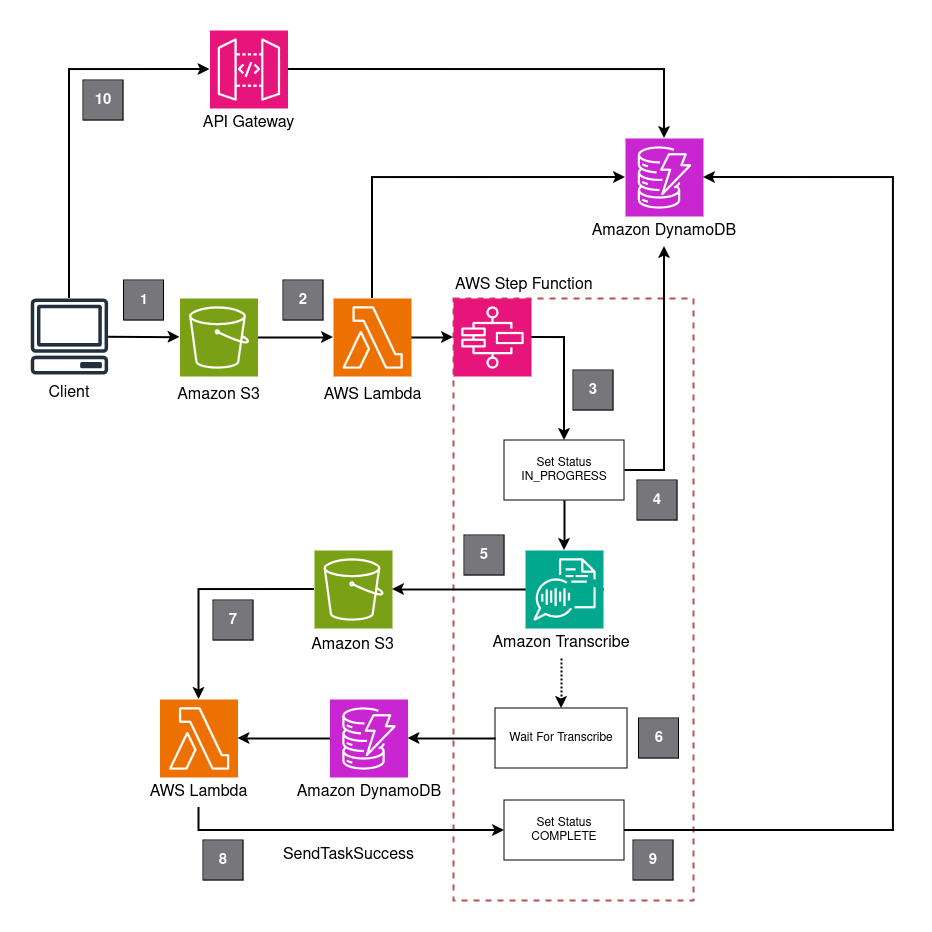

# Simple Audio & Video Transcription on AWS

_Version: 1.0_
_For support contact [MakeOps](https://www.makeops.com/contact)_

This project provides the AWS CDK to build and deploy an audio / video transcription workflow in AWS. It makes use of AWS native, serverless technologies such as Amazon S3, Amazon Transcribe and AWS Step Functions.

## Overview

Audio / video transcription is becoming a first step for companies looking to leverage AI within their products and services. This use-case fits in with some example applications such as: transcribing audio from podcasts to understand the connections between topics in different episodes; understanding the sentiment of contact center call; or analyzing audio from medical patient discussions.

This project provides a deployable component written in AWS CDK, using Python as the core language inside AWS Lambda functions. To do this, the project leverages container-based lambda functions.

## Design Decisions

**Users:** Although authentication is not the focus for this component, this component has an option to include AWS Cognito details to allow authentication using cognito JWTs. There component has a built-in "user" that can be set either from providing the JWT as metadata in the uploaded file (`token` user info) or via the `user` metadata parameter (`user` user info). This allows you to introduce the idea of different users into your system.

**Lambda Containers:** The code for the lambda functions is written in Python. To make it easier to deploy, it makes use of container-based lambda functions. At the time of writing the [native support for python in CDK](https://github.com/aws/aws-cdk/tree/main/packages/%40aws-cdk/aws-lambda-python-alpha) is still being worked on.

## Architecture

The architecture hinges on an AWS Step Function that handles orchestration between different components.



The architecture functions as follows:

1. Client uploads a audio / video file to Amazon S3. Optional authentication via Amazon Cognito can be configured
2. The S3 PutObject event triggers an AWS Lambda function that adds a job record into Amazon DynamoDB, assembles a payload for the AWS Step Function and then executes the step function
3. The first step of the AWS Step Function updates the Amazon DynamoDB record to job_status = `IN_PROGRESS`
4. Progress on the transcription job is kept in an Amazon DynamoDB table which allows users to query the status for longer-running transcriptions. An [optimized DynamoDB step](https://docs.aws.amazon.com/step-functions/latest/dg/connect-ddb.html) is used to update the table from the step function.
5. Within the AWS Step Function the next step is to trigger the `StartTranscriptionJob` API. This is done via an [AWS SDK service integration](https://docs.aws.amazon.com/step-functions/latest/dg/supported-services-awssdk.html)
6. Next in the Step Function is a [wait for callback](https://docs.aws.amazon.com/step-functions/latest/dg/connect-to-resource.html#connect-wait-token) pattern. A SDK service integration updates the record in DynamoDB with the TaskToken.
7. Once processing of the file is complete Amazon Transcribe will place the result in an S3 results bucket. This is configured to trigger an Lambda function that retrieves.
8. The AWS Lambda function fetches the TaskToken from DynamoDB and then triggers `SendTaskSuccess` for the step function to continue.
9. The last step of the Step Function is to update the record to show the transcription job_status = `COMPLETE`.
10. This solution includes a stack for an Amazon API Gateway HTTP endpoint that can be used to retrieve the state of the transcription jobs. It's up to you how you configure and define the logic of this API.

## Extensions & Further Development

**Pre-processing of files:** The `workflow.handle_event` function is triggered when the file is uploaded. You can add logic here to check for file size, if the customer is a priority, if there are any requirements from the metadata of the file.

**Post-processing of files:** The `workflow.handle_transcribe_complete_event` function is triggered when a result from Amazon Transcribe is sent to S3. You can add custom logic to do any pre-processing of the results in S3. When done trigger the next step of the step function using the `SendTaskSuccess` call.

### Language Code for Amazon Transcribe

The language that is passed to Amazon Transcribe when performing the `StartTranscriptionJob` can be set in `cdk.json` under the `makeops/transcribe-locale` parameter. See [API Documentation](https://docs.aws.amazon.com/transcribe/latest/APIReference/API_StartTranscriptionJob.html#API_StartTranscriptionJob_RequestSyntax) for more details. It's recommended to update this to be more dyanamic if your use-case requires it.

## How to Deploy?

1. Copy the `values.default.yaml` to a new file `values.yaml` and update the configuration accordingly. See the [configuration options](#configuration-options) below.
2. Install dependencies for this project

```bash
$ npm install
```

3. Deploy the CDK stack

```bash
$ cdk --profile <your-profile-name> deploy --all
```
_Accept any prompts about the IAM changes_

## Usage

There are 2 S3 Buckets that are deployed. One is for input audio / video objects that need to be transcribed. One is for the resulting transcriptions.

- Logical ID `UploadBucket` is where you upload the files.

There's a DynamoDB table that stores the progress of transcription jobs. If you set the configuration to enable the API then there will be a separate stack that will allow you to query the status of the transcription jobs.


### Uploading a File

Upload a file to `UploadBucket` using either the AWS SDK, AWS CLIs or via the console.

```bash
$ aws s3 cp sample-audio.mp3 s3://simpleaudiovideotranscription-uploadbucketd2c1da78-davlqupphx3y/uploads/sample-audio.mp3
```

## Use-case #1 - Frontend Authentication with Amazon Cognito

With the following configured in `values.yaml` this stack will function for frontend applications.

```yaml
s3CorsEnabled: true

s3CorsOrigins:
- http://localhost:5173 # set appropriately

s3UserInfo: token # token

apiEnabled: true

apiAuthMethod: cognito # cognito aut

apiCognitoUserPoolId: eu-west-1_YCtOEmpFc # set appropriately
apiCognitoAppClientId: 69bi143vpcr4niakpo3dmjs9jj # set appropriately

apiCorsEnabled: true # cors for frontend JS access

apiCorsOrigins:
- http://localhost:5173 # set appropriately
```

Ensure you deploy the stack using the above configuration.

### Uploading a File

To upload a file using this configuration, use frontend javascript (i.e. [AWS JS SDK v3](https://github.com/aws/aws-sdk-js-v3)).

```ts
import { fromCognitoIdentityPool } from "@aws-sdk/credential-providers";
import { CognitoIdentityClient, GetIdCommand } from "@aws-sdk/client-cognito-identity";

// set the following according to your setup
const cognitoRegion = 'eu-west-1'
const cognitoClientId = ''

// You'll need to have authenticated to get an access & id token. See cognito docs.
const accessToken: string
const idToken: string

const uploadFileItem: File

function credentialsFromToken(jwt) {
  return fromCognitoIdentityPool({
    identityPoolId,
    logins: {
      [`cognito-idp.${cognitoRegion}.amazonaws.com/${cognitoClientId}`]: jwt
    },
    clientConfig: { region },
    userIdentifier: `frontend-user`,
  })
}

async function getIdentityPoolId(jwt: string) {

  const cognitoClient = new CognitoIdentityClient({
    region: 'eu-west-1',
    credentials: credentialsFromToken(jwt)
  })

  const getIdCommand = new GetIdCommand({
    IdentityPoolId: identityPoolId,
    Logins: {
      [`cognito-idp.${cognitoRegion}.amazonaws.com/${clientId}`]: jwt
    }
  })

  const getIdResponse = await cognitoClient.send(getIdCommand)
  return `${getIdResponse.IdentityId}`

}

const identityPoolId = getIdentityPoolId(idToken)

const client = new S3Client({
  region: cognitoRegion,  // set accordingly
  credentials: credentialsFromToken(idToken),
});

const upload = new Upload({
  client: client,
  params: {
    Bucket: uploadBucketName,
    Key: `uploads/${identityPoolId}/${randomString(10)}-${uploadFileItem.name}`,
    Body: uploadFileItem,
    ContentType: uploadFileItem.type,
    Metadata: { 'token': $userInfo.accessToken }
  },
});

await upload.done();
```

The uploaded file is put into a location based on the identity pool id. This is because there is an IAM policy to restrict access so users can only upload to that location.

### Use-case #1 - Backend Uploads

If you want to upload files from S3 using backend services that have IAM credentials then use the following `values.yaml`.

```yaml
s3UserInfo: user
```

In this mode, you can trigger a transcription job using by sending files directly to the `Upload` bucket.

```bash
$ aws s3 cp sample-file.mp3 s3://uploadbucketname-abcede/uploads/sample-file.mp3 --metadata 'User=custom-user-id'
```

This will save the upload progress in DynamoDB against the pk `custom-user-id`. This allows you to segregate files based on the user.

If no User is provided, the pk will be set to `unknown`.

## Available Configuration Options

| Configuration Option | Possible Values | Default Value | Details |
|----------------------|-----------------|---------------|---------|
| `transcribeLocale` | Any valid AWS Transcribe language code | "en-ZA" | Language to pass to StartTranscriptionJob |
| `s3CorsEnabled` | true, false | true | Toggle to enable CORS on S3 Upload Bucket |
| `s3CorsOrigins` | List of URLs | ["http://localhost:5173"] | If S3 cors is enabled, set the allowed origins |
| `s3UserInfo` | token, user, none | token | Configures the mechanism to determine the user that uploaded the file |
| `apiEnabled` | true, false | true | Toggle deployment of the API stack |
| `apiAuthMethod` | cognito, none | cognito | Define the auth method |
| `apiCognitoUserPoolId` | Valid Cognito User Pool ID | <CognitoUserPoolId> | Required if apiAuthMethod = 'cognito' |
| `apiCognitoAppClientId` | Valid Cognito App Client ID | <CognitoAppClientId> | Required if apiAuthMethod = 'cognito' |
| `apiCorsEnabled` | true, false | true | Toggle if Cors are set for the API Gateway endpoint |
| `apiCorsOrigins` | List of URLs | ["http://localhost:5173"] | If apiCorsEnabled is true, these origins are set for API Gateway |


## Clean Up

If you're done playing around with this component, delete it using the cdk destroy operation.

```bash
$ cdk destroy --all
```

## Support

This cloud component was built by [MakeOps](https://www.makeops.com). If you have queries, please open a pull-request or feel free to reach out via our [Contact Us](https://www.makeops.com/contact). We can provide support:

- Deployment Guidance for this Cloud Component
- Architecture Reviews on AWS
- Extension of this component and building of additional components.
