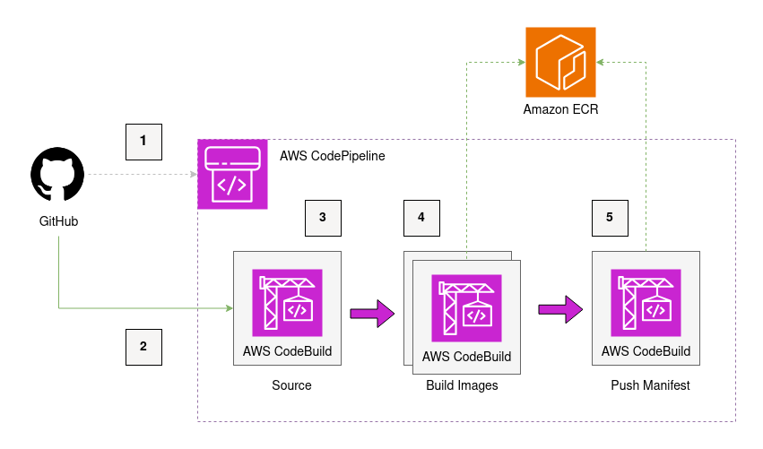
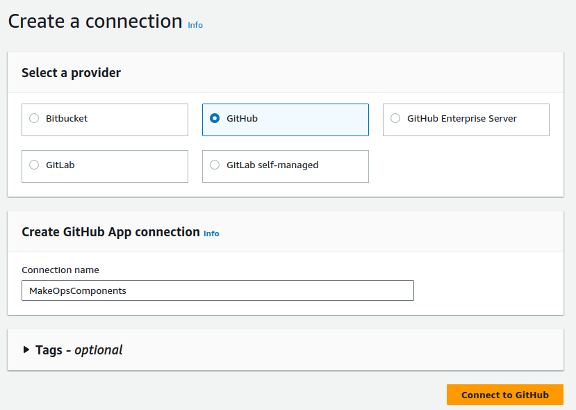
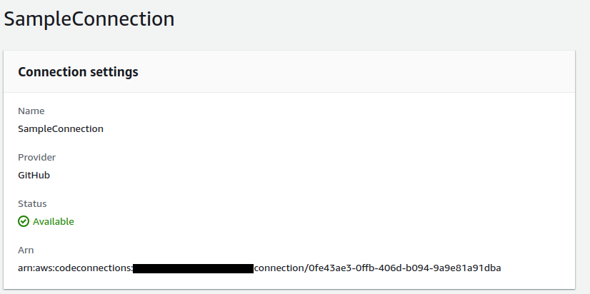
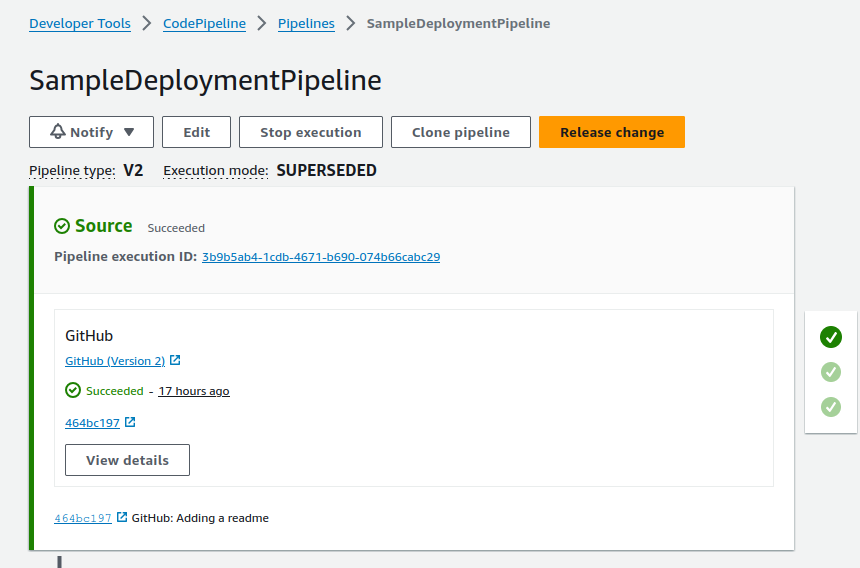

# Simple Multi-Arch Container Build Pipeline

_Version: 1.0_
_For support contact [MakeOps](https://www.makeops.com/contact)_

This project provides the AWS CDK to deploy a multi-arch container build pipeline using AWS native technology.

## Overview

The operating system landscape is evolving. The AMD architectures are making way for the new wave of ARM based CPUs. The reason is multi-fold: Apple's new line of M-series laptops are now ARM by default; on AWS Graviton is ARM based; and when you observe some of the benefits, it's obvious that this will continue.

The challenge is that many developers might still be working on AMD architectures. In the HPC world, AMD is still a big player as seen with the latest AWS [M7a](https://aws.amazon.com/ec2/instance-types/m7a/) & [C7a](https://aws.amazon.com/ec2/instance-types/c7a/) EC2 instances.

Alongside this the use of containers is still as strong as ever. Therefore the need to cater to multiple architectures (amd and arm) is becoming essential to maintain product velocity in our teams.

This MakeOps Cloud Component offers a, quick to deploy, CDK template to configure a multi-arch CI/CD pipeline for building images from GitHub.

## Design Decisions

**AWS CodePipeline** is used as the main CI / CD tool for the configuration of the pipeline. AWS CodePipeline is serverless & extendable so it's a natural choice for this type of workload. AWS CodePipeline manages co-ordination of different AWS CodeBuild steps that perform the docker build process.

**Docker in Docker** is a technique used to build a container in AWS CodeBuild. When each CodeBuild instance is started, a dockerd command is called to start a daemon. This is then accessible by various docker commands.

**Manifest Creation** the deployed pipeline support two architectures `arm64` & `amd64`. During the pipeline, these are run in-parallel to produce docker tagged images that have the `-arm64` and `-amd64` suffixes respectively. The final outcome of the pipeline is a tagged manifest that points to the two other images. This allows you to configure services such as ECS and EKS without needing to specify the architecture.

### Example Images Created

When this component is configured with the `latest` `tagRule` and the destination repo is `makeops/sample-repo`, the resulting images in the Amazon ECR repo will be as follows:

- `makeops/sample-repo:latest-amd64` - Docker image built for AMD CPUs
- `makeops/sample-repo:latest-arm64` - Docker image built for ARM CPUs
- `makesops/sample-repo:latest` - Docker manifest that points to `makeops/sample-repo:latest-amd64` and `makeops/sample-repo:latest-arm64`

In your ECS or EKS environments you can use `makesops/sample-repo:latest` and the container runtime should pull the correct images according to the arch of the host.

## Architecture

The architecture is simple and only relies on a couple of steps configured within an AWS CodePipeline pipeline.



The architecture functions as follows:

1. If configured, the solution gets triggered when new commits land in the `main` branch. This triggers and AWS CodePipeline pipeline.

2. The connection between GitHub and AWS is configured via a connection ARN. This allows AWS CodePipeline to interact with the repo.

3. The source stage copies the files from GitHub and adds it to an Artifact that is then shared with subsequent stages of the pipeline.

4. The build stage makes use of parallel docker-in-docker and privileged containers in AWS CodeBuild to build and tag the images - one for `amd64` and `arm64` . These images are then pushed to the configured ECR repo. If the repo doesn't exist already, then this solution will create a target repo in Amazon ECR.

5. The final step happens after the images have been built and pushed to ECR. A manifest of the two architecture images is created and pushed to ECR. [See the AWS docs on this process](https://docs.aws.amazon.com/AmazonECR/latest/userguide/docker-push-multi-architecture-image.html)


## Deploying the Cloud Component

### Pre-Requisite - Create a Code Connection in the AWS Console

From the Code Suite console go to Settings > Connections on the side-panel. Here you can see a list of connections that are available (if any). **If you already have a connection** to GitHub that works, then you can skip this step.

Choose "Create Connection" and choose GitHub, the naming here doesn't matter too much as long as you have a Connection ARN for the cloud component.



You will be pushed through an GitHub OAuth flow to choose the repos that you want AWS to be able to access. If you'll be using this tool a lot then you can choose to allow access to all repos, if this is the first time you're using this component, then set permissions to the repo that you want to build from.

Once complete you should see that the connection is active.




### Pre-Requisite Dockerfile Best Practices

In order to have a successful build, the repo that you choose to build from must have a Dockerfile. It doesn't matter what is in the Dockerfile, the solution should run.

To build for different architectures this component will perform the equivalent of the following command, where `<arch>` is either `amd64` or `arm64`.

```bash
$ docker build --build-arg ARCH=<arch> -t sample-repo:latest .
```

To change the behavior of your builds for each architecture, you can make use of a [Docker build argument](https://docs.docker.com/reference/dockerfile/#arg) in the Dockerfile.

An example dockerfile that builds a golang app is as follows:

```Dockerfile
FROM public.ecr.aws/docker/library/golang:1.22.6-bookworm

ARG ARCH=amd64 # Sets amd64 as a default

COPY . .

RUN GOOS=linux GOARCH=$ARCH go build *.go
```

## Update Configuration and Deploy

1. Copy the `values.default.yaml` to a new file `values.yaml` and update the configuration accordingly. See the [configuration options](#configuration-options) below.

The following are required configurations:

```yaml
source:
  github:
    owner: <owner of the repo>
    repo: <repo name>
    connectionArn: <copy the connection ARN from the code connections console>

destination:
  ecr:
    repoName: <destination repo in ecr>
```

By default the `repoName` will be created, if you already have a repo in ECR, set `exists: true`.

2. Install dependencies for this project

```bash
$ npm install
```

3. Deploy the CDK stack

```bash
$ cdk --profile <your-profile-name> deploy --all
```

_Accept any prompts about the IAM changes_

## Usage


Once the component is deployed, you can push to the configured repo and see that the pipeline in the AWS CodePipeline console gets triggered.



As output you should see 3 items present in the ECR repository.

- `repo/name:<commit>-arm64` image
- `repo/name:<commit>-amd64` image
- `repo/name:<commit>` manifest

By default the tag rule is that each image is tagged with the hash of the latest commit from GitHub. This is a best practice as it allows you to track which code is compiled into which image.


## Configuration - Tag Rules

This Cloud Component has three `tagRules` that you can use to configure the tagging strategy of your final docker images. You can add the `tagRules` to the `values.yaml` config, the available options are:

- `commit` - this tags the images with the full git commit hash from the source repo. This is good to match the code in GitHub with the image in ECR.
- `commit-short` - this is the same as `commit` but the commit hash is truncated to 8 characters, this makes it easier for developer to reference.
- `latest` - this will tag the images with the `latest` tag. There are various best-practice around pushing images to the latest tag. One is to ensure that you always deploy images in services using a specific tag. This prevents accidental code deployment when a container stops and pulls a latest image that might not have gone through CI/CD.

## Available Configuration Options

| Configuration Option | Default Value | Allowed Values | Description |
|----------------------|---------------|----------------|-------------|
| `pipelineName` | None | Any string | The name of the deployment pipeline. |
| `source.github.owner` | None | Valid GitHub username or organization name | The owner of the GitHub repository. |
| `source.github.repo` | None | Valid GitHub repository name | The name of the GitHub repository. |
| `source.github.connectionArn` | None | Valid AWS ARN | The Amazon Resource Name (ARN) of the connection used to retrieve files from GitHub. |
| `source.github.branch` | None | Valid Git branch name | The branch to use when pulling the configuration. |
| `source.github.triggerOnPush` | None | `true` or `false` | Indicates whether to trigger the pipeline when new code is pushed to the repository. |
| `workDir` | `''` (empty string) | Any valid directory path | The working directory for the build steps. |
| `destination.ecr.repoName` | None | Valid ECR repository name | The name of the ECR repository where the images will be stored. |
| `destination.ecr.exists` | None | `true` or `false` | Indicates whether the destination repository already exists. |
| `destination.ecr.tagRules` | None | Array of: `latest`, `commit`, `commit-short` | Specifies how to tag the output images. |

## Clean Up

If you're done playing around with this component, delete it using the cdk destroy operation.

```bash
$ cdk destroy --all
```

## Support

This cloud component was built by [MakeOps](https://www.makeops.com). If you have queries, please open a pull-request or feel free to reach out via our [contact us form](https://www.makeops.com/contact). We can provide support:

- Deployment Guidance for this Cloud Component
- Architecture Reviews on AWS
- Extension of this component and building of additional components.
