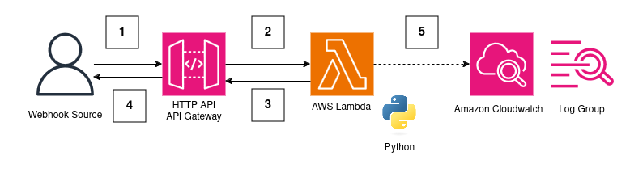

# Simple Python Webhook on AWS

_Version: 1.0_

This project provides the AWS CDK code to build and deploy a simple python webhook listener in AWS.

## Overview

There are many tools and services that provide webhook functionality. Webhooks are a way for a SaaS application to trigger some custom action in a different workflow or process. For example, if you're using Shopify as your main e-commerce platform you may want to trigger some other process (i.e. your website) when a [different actions](https://shopify.dev/docs/api/webhooks?reference=toml#list-of-topics) are performed.

This project provides a deployable component written in AWS CDK, using Python as the core language inside and AWS Lambda function. To do this, the project leverages container-based lambda functions.

## Design Decisions

**WARNING** this solution does not implement any authentication. This means that anybody who knows the URL will be able to access the URL. Every time the URL is accessed you may incur charges. Take a look at the [AWS Lambda](https://aws.amazon.com/lambda/pricing/) and [Amazon API Gateway](https://aws.amazon.com/api-gateway/pricing/) pricing to consider what your bill may be. **Suggestion** deploy this component and perform some tests to get an idea of the costs before pushing into a production environment.

**Container-Based Code** when this component is deployed, the code is bundled into a container before being deployed. This allows you easily add dependencies to your python code.

**Poetry Python Package Manager** for package management we've made use of [Poetry](https://python-poetry.org/) because we at MakeOps it's our standard practice.

**Security** The endpoint that is deployed is an AWS API gateway endpoint. These endpoints automatically have an HTTPS certificate attached to ensure that communication between the client or application and the server is encrypted.

## Architecture

The architecture use API Gateway and AWS Lambda to create an python webhook listener deployed in AWS.



The architecture functions as follows:

1. User or External Application accesses the webhook via API Gateway
2. The API gateway has an integration to AWS Lambda, when a webhook is received by API gateway, the python lambda function code is triggered.
3. The python webhook trigger function runs and returns a value to API Gateway
4. The user receives the response from the webhook
5. During the function trigger, any logs are sent to Amazon CloudWatch (**Note** the logs are set to only be retained for 2 weeks to save costs)


## Extensions & Further Development

**Adding Authentication** You can add authentication using the [AWS CDK Authorizers](https://docs.aws.amazon.com/cdk/api/v2/docs/aws-cdk-lib.aws_apigatewayv2-readme.html#managing-access-to-http-apis). This is best practice to ensure that only authorized systems and users can access your python webhook.

## Deployment - Pre-requisites

You'll need to have the following setup before you can deploy this component:

- AWS CLI Installed & Configured
- AWS CDK Installed & Configured
- PNPM or NPM installed with v20.14 or greater
- Docker installed and running
- Git Installed
- _Optional_ HTTPie installed and configured - to test the webhook
- _Optional_ [AWS SAM](https://docs.aws.amazon.com/serverless-application-model/latest/developerguide/install-sam-cli.html#install-sam-cli-instructions) installed and configured - to view logs

## Deployment

1. Clone the repo and change to the component directory.

```bash
$ git clone git@github.com:MakeOps/components.git
$ cd simple-python-webhook
```

2. Update the code you want to run when a webhook is received in `code/handler.py`

```python
def webhook_handler(event, _context):
    '''Webhook Event Handler Function'''

    # For an example event see example.json
    print(json.dumps(event))

    ## ======= YOUR CODE ========

    response_payload = {'version': '0.1.0'}

    ## ==== END OF YOUR CODE ====

    return {
        'statusCode': 200,
        'body': json.dumps(response_payload),
        'headers': {
            'Content-Type': 'application/json'
        }
    }
```

Save the file.

3. Install the dependencies using npm or pnpm

```bash
$ pnpm install
$ # OR
$ npm install
```

4. Deploy the stack to your AWS environment

```bash
$ cdk deploy --all
```

_Accept any prompts about the IAM changes_

## Usage

When the stack finishes deploying you should see that there are two variables that are output in your command line:

```bash
[...]
Outputs:
SimplePythonWebhookStack.APIEndpoint = https://pwsw41taz9.execute-api.eu-west-1.amazonaws.com
SimplePythonWebhookStack.LoggingOutput = /aws/lambda/SimplePythonWebhookStack-WebhookFunction59DCB58D-UelSZjxMj0I0
Stack ARN:
arn:aws:cloudformation:eu-west-1:375479154925:stack/SimplePythonWebhookStack/b626bf50-540f-11ef-aab5-063ed5e6995f
[...]
```

- `APIEndpoint` is the endpoint for your webhook, this is what you register with a third-party
- `LoggingOutput` is where the logs for your webhook python function are sent


### Triggering a Webhook

You may use any tool to do this but we prefer [httpie](https://github.com/httpie). You may use Postman or Curl.

```bash
$ http POST https://pwsw41taz9.execute-api.eu-west-1.amazonaws.com name=makeops
HTTP/1.1 200 OK
Apigw-Requestid: cGMi_haHjoEEPmw=
Connection: keep-alive
Content-Length: 20
Content-Type: text/plain; charset=utf-8
Date: Tue, 06 Aug 2024 17:18:23 GMT
{
    "version": "0.1.0"
}
```

### Viewing the Logs from our Python Webhook

To view the logs you can navigate to [Amazon CloudWatch Logs](https://console.aws.amazon.com/cloudwatch/home#logsV2:log-groups) to find the log group mentioned in `LoggingOutput` above.

Alternatively (and in our opinion better) is to use SAM CLI:

```bash
$ sam logs -t --cw-log-group /aws/lambda/SimplePythonWebhookStack-WebhookFunction59DCB58D-UelSZjxMj0I0
```

_This should show you some of the most recent logs from your webhook._


## Clean Up

If you're done playing around with this component, delete it using the cdk destroy operation.

```bash
$ cdk destroy --all
```

## Next Steps

Once you've got the webhook deployed you can start to update the python code inside the `handler.py` file.

As a starting point, try connect the webhook endpoint into an application that emits webhooks and the get an event to trigger. You can view the logs to get an idea of the structure of the webhook event, then create code to handle the event in a customized way.

## Troubleshooting

### Function Timeouts

When your webhook handler starts to get more complex, you may start to see errors due to timeouts. This is because the AWS lambda function has been configured with a default timeout of 3 seconds.

If you start to see timeouts there are 2 options:

1. Increase the timeout of the AWS Lambda function (default is 3 seconds) - this allows more time for the function to finish executing. This will affect the cost of your lambda function executions.
2. Increase the memory for the AWS Lambda function (default is 128) - this will allow more memory for the function so the code will execute faster.

```ts
const webhookHandler = new DockerImageFunction(this, 'WebhookFunction', {
  code: DockerImageCode.fromImageAsset(join(__dirname, 'code'), {
    entrypoint: ["/usr/local/bin/python", "-m", "awslambdaric"],
    cmd: ["handler.webhook_handler"]
  }),
  logRetention: RetentionDays.TWO_WEEKS,
  timeout: cdk.Duration.seconds(10),   // Increase the timeout of the webhook
  memorySize: 1024  // Increases the memory size for the webhook
})
```

To update the component you can run the deploy function again.

```bash
$ cdk deploy --all
```

## Support

This cloud component was built by [MakeOps](https://www.makeops.com). If you have queries, please open an issue or pull-request or reach out via our [contact us form](https://www.makeops.com/contact). We can provide support:

- Deployment Guidance for this Cloud Component
- Architecture Reviews on AWS
- Extension of this component and building of additional components.
